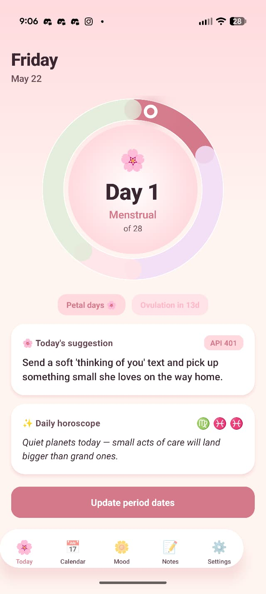

# 🌸 Bloom

A small, local-first period tracker I built for my girlfriend. No accounts, no cloud, no analytics — just a soft, calm space to track her cycle, log moods, write little notes, and get a gentle daily suggestion + horoscope.

<p align="center">
  
</p>

## ✨ What it does

- **Cycle tracking** — log period start/end dates with a date picker. Adjusts the predicted cycle length based on her actual history.
- **Phase visualization** — animated cycle wheel showing menstrual, follicular, ovulation, and luteal phases with a glowing indicator for today.
- **Calendar** — month grid with phase-coloured days, so you can see at a glance where she is in her cycle.
- **Mood logger** — phase-aware multiple-choice prompts ("Crampy" / "Tender" during menstrual, "Glowing" / "Magnetic" during ovulation, etc.) with optional notes.
- **Notes** — quick free-form notes with tags for things you want to remember (gift ideas, things she's mentioned, patterns you've noticed).
- **Daily AI suggestion + horoscope** — one warm, specific suggestion per day for how to support her based on her current phase + recent moods, plus a daily reading blended from her sun, moon, and rising signs. Powered by OpenAI's `gpt-4o-mini`.
- **Proactive nudges** — local notifications for "period in 2 days", "ovulation today", phase transitions, and gentle mood check-ins (only in standalone builds — Expo Go limits notifications).

## 🔒 Privacy & data

**All data lives locally on your device** in a SQLite database (`bloom.db`). It never leaves the phone.

- No backend, no API server, no analytics.
- No login, no account.
- The only network call is to OpenAI's API for daily suggestions, and only if you've added an `OPENAI_API_KEY` — without it the app falls back to canned evergreen suggestions.
- Uninstall the app and every byte of her data goes with it.

## 🛠 Built with

- [Expo](https://expo.dev) (SDK 54)
- [Expo Router](https://docs.expo.dev/router/introduction/)
- [expo-sqlite](https://docs.expo.dev/versions/latest/sdk/sqlite/) — local storage
- [@shopify/react-native-skia](https://shopify.github.io/react-native-skia/) — GPU-accelerated cycle wheel
- [react-native-reanimated](https://docs.swmansion.com/react-native-reanimated/) — UI-thread animations
- [date-fns](https://date-fns.org) — date math
- OpenAI Chat Completions API

## 📱 Run it on your phone

### Prerequisites

- Node.js 20+ (or 22+, 24+)
- An Android or iOS phone with [Expo Go](https://expo.dev/go) installed
- (Optional) An OpenAI API key for AI suggestions

### Setup

```bash
git clone https://github.com/notaaryansh/period-tracking-app.git
cd period-tracking-app
npm install --legacy-peer-deps
```

Create a `.env` in the project root (optional — without it the app falls back to canned suggestions):

```bash
OPENAI_API_KEY=sk-...
```

### Start the dev server

```bash
npx expo start
```

Then on your phone:

- **Android** → open Expo Go → "Scan QR code" → point at the QR in the terminal
- **iOS** → open the Camera app → point at the QR → tap the Expo Go banner

Same WiFi required. If LAN is flaky, use `npx expo start --tunnel`.

### Build a standalone APK (no Expo Go required)

```bash
npm install -g eas-cli
eas login
eas build --profile preview --platform android
```

You'll get a link to an `.apk` you can install on your phone directly. iOS standalone builds need an Apple Developer account ($99/yr).

## 🗺 Roadmap

These are things I might add later (or you might, if you fork it). Not promises.

- [ ] **Better horoscope** — more nuanced daily readings, transit awareness, possibly a small "compatibility with you" view if you add your own signs.
- [ ] **Cloud backup (device-only)** — opt-in encrypted backup to her own iCloud / Google Drive folder so a lost phone doesn't lose her data. **Still no third-party server.**
- [ ] **Downloadable release** — pre-built APK + TestFlight builds so non-developers can install it without running the dev server. Would ship in two flavours: one with OpenAI integration (bring-your-own-key) and one fully offline.
- [ ] **Symptoms tracking** — flow intensity, cramps, sleep, skin, etc.
- [ ] **Smart insights** — "her mood tends to dip 2 days before her period" type observations from her own logged data.
- [ ] **Themes** — light variants and maybe a dark mode for night-time logging.

**Not on the roadmap (probably ever):** accounts, auth, a backend. I built this just for one person and the whole point is that it stays local. If you fork it for wider use, those are yours to add.

## 🌷 Contributing

This was a personal project for my girlfriend, so I'm not actively soliciting contributions — but the code is yours under MIT. Fork it, build something for your own person, share what you make.

## License

MIT — see [LICENSE](LICENSE).
